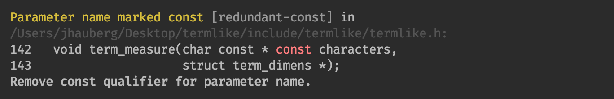

# comply

<br/>

A linter tool to help programmers enforce a consistent coding style for sources written in C99.

By way of static code analysis (see [Pattern matching](#pattern-matching)), the aim is to make style issues apparent while providing helpful hints and suggestions on how to fix them.

**Strict style compliance**

`comply` defines and applies some (highly) opinionated and strict rules and conventions on best practices for writing code that is both readable and maintainable.



Following these rules will help enforce consistency and improve maintainability throughout your project. You might not like some of them, but each has thought and reasoning behind it.

You can read more about the thoughts behind each rule on the [project page](http://jhauberg.github.io/comply).

## Installation

Install straight from the source:

```console
$ python setup.py install
```

<details>
  <summary><strong>It doesn't work</strong></summary>

<br/>

There's a few things that could go wrong during an install. If things didn't go as expected, check the following:

**You may have more than one Python version installed**

Some systems may have multiple Python versions installed and available. This project requires Python 3.5 or later, so you may need to specify that you want to use a later version:

```console
$ python3 setup.py install
```

**Your PATH environment variable may be incorrect**

When you first installed Python, the installer probably added the `PATH` automatically to your `~/.profile` or `~/.bash_profile`. However, in case it didn't, it should look something like this:

```bash
PATH="/Library/Frameworks/Python.framework/Versions/3.6/bin:${PATH}"
export PATH
```

You may additionally need to add the `PYTHONPATH` variable and have it point to the `site-packages` directory of your Python version; for example, for a Python 3.6 installation, the variable could look like this:

```bash
export PYTHONPATH="${PYTHONPATH}/Library/Frameworks/Python.framework/Versions/3.6/lib/python3.6/site-packages"
```

</details>

<details>
  <summary><strong>Uninstalling</strong></summary>

<br/>

If you want to uninstall `comply` and make sure that you get rid of everything, you can run the installation again using the additional `--record` argument to save a list of all installed files:

```console
$ python setup.py install --record installed_files.txt
```

You can then go through all listed files and manually delete each one.

</details>

### Requirements

- Python 3.5+
- [docopt](https://github.com/docopt/docopt)

## Usage

When installed, you can run `comply` on the command line.

> *It's recommended to enable all warnings and errors that your compiler provides and run `comply` as a supplement once your project compiles.*

You can provide `comply` with single files or entire directories:

```console
$ comply mylib.h mylib.c
```

If provided with a directory, `comply` will automatically traverse the entire directory and run on each appropriate file found inside (also in sub-directories):

```console
$ comply mylib/src/
```

<details>
  <summary><strong>Running without installing</strong></summary>

<br/>

You can also run `comply` without having to first install it.

**1) By executing the supplied run script**

From anywhere, simply execute [run.py](run.py) with the same arguments that you normally would `comply`. The script is found at the root of the project.

```console
$ python path/to/comply/run.py src.h src.c --reporter=standard
```

**2) By executing the module as a script**

This requires the working directory to be at the root of the project.

```console
$ cd path/to/comply
$ python -m comply path/to/src/
```

</details>

### Integrating with Xcode

`comply` can be integrated as a *Run Script Build Phase* in Xcode to have violations reported directly in the IDE:


You have two options for making this happen:

<details>
  <summary><strong>1) Using installed executable (*recommended*)</strong></summary>

<br/>

First, figure out exactly where `comply` has been installed to:

```console
$ which comply
```

This should provide you with a path to the executable, e.g. something like:

```console
/Library/Frameworks/Python.framework/Versions/3.6/bin/comply
```

In Xcode, add a new *Run Script Phase*. Copy and paste below snippet into the script editor. Replace `<executable>` with the path to the `comply` executable that you just found.

```shell
export PYTHONIOENCODING=UTF-8

<executable> "${SRCROOT}" --reporter=oneline
```

For example, this would become:

```shell
export PYTHONIOENCODING=UTF-8

/Library/Frameworks/Python.framework/Versions/3.6/bin/comply "${SRCROOT}" --reporter=oneline
```

</details>

<details>
  <summary><strong>2) Using script sources directly</strong></summary>

<br/>

If you prefer not installing, you can still use the phase script as described in **1)**. It can be useful to avoid installing if you're working on new features or fixing bugs.

Just point to the [run.py](run.py) script instead of the installed executable:

```shell
export PYTHONIOENCODING=UTF-8

python path/to/comply/run.py "${SRCROOT}" --reporter=oneline
```

</details>

<br />

Now, every time you build, `comply` will be run on every file and directory within the root of your project. 

You can change or add arguments as you like, but `--reporter=oneline` is required for violations to be displayed as pop-ups.

### Full usage

```console
Make your C follow the rules

Usage:
  comply <input>... [--reporter=<name>] [--check=<rule>]... [--except=<rule>]...
                    [--limit=<amount>] [--verbose] [--strict]
  comply -h | --help
  comply --version

Options:
  -r --reporter=<name>    Specify type of reported output [default: human]
  -c --check=<rule>       Only run checks for a specific rule
  -e --except=<rule>      Don't run checks for a specific rule
  -i --limit=<amount>     Limit the amount of reported violations
  -s --strict             Show all violations (similar violations not suppressed)
  -v --verbose            Show diagnostic messages
  -h --help               Show program help
  --version               Show program version
```

## Other linters

### Pattern matching

Unlike most linters, `comply` exclusively use Regex and pattern matching to determine violations. This makes `comply` *worse* than the alternatives (e.g. `clang-tidy`) in some cases, and may even have a higher tendency toward false-positives which a compiler-backed linter would not.

On the upside, it allows `comply` to be much more lean in terms of dependencies and portability, and, I dare say, friendlier and easier to get into for people wishing to add or improve functionality.

## License

This is a Free Open-Source Software project released under the [MIT License](LICENSE).

*Logo with courtesy of [game-icons.net](http://game-icons.net/lorc/originals/black-flag.html)*
