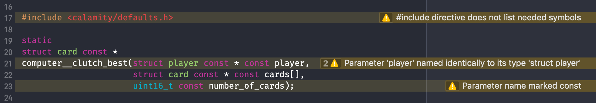

# comply

<br/>

A style guide and linter to help enforcing better practices when writing C99.


Jump to: [Usage](#usage), [Options](#options), [Integration](#integrating-with-xcode), [FAQ](#faq)

## Installation

You can install `comply` straight from the source:

```console
$ python setup.py install
```

<details>
  <summary><strong>It doesn't work</strong></summary>

<br/>

There's a few things that could go wrong during an install. If things didn't go as expected, check the following:

**You might have more than one Python version installed**

Some systems may have multiple Python versions installed and available. This project requires Python 3.5 or later, so you may need to specify that you want to use a later version:

```console
$ python3 setup.py install
```

**Your PATH environment variable might be incorrect**

When you first installed Python, the installer probably added the `PATH` automatically to your `~/.profile` or `~/.bash_profile`. However, in case it didn't, it should look something like this:

```bash
PATH="/Library/Frameworks/Python.framework/Versions/3.6/bin:${PATH}"
export PATH
```

You may additionally need to add the `PYTHONPATH` variable and have it point to the `site-packages` directory of your Python version; for example, for a Python 3.6 installation, the variable could look like this:

```bash
export PYTHONPATH="${PYTHONPATH}/Library/Frameworks/Python.framework/Versions/3.6/lib/python3.6/site-packages"
```

</details>

<details>
  <summary><strong>Uninstalling</strong></summary>

<br/>

If you want to uninstall `comply` and make sure that you get rid of everything, you can run the installation again using the additional `--record` argument to save a list of all installed files:

```console
$ python setup.py install --record installed_files.txt
```

You can then go through all listed files and manually delete each one.

</details>

### Requirements

- Python 3.5+
- [docopt](https://github.com/docopt/docopt)

## The *Compliant* Style

C is a great language; it gives you a lot of power, control and a degree of freedom that allow you to do things your own way.

That power, however, can often lead to bad, or at the very least, unconventional, practices.

The *Compliant* style can be applied to mitigate this concern. It is comprised of a set of sensible (but opinionated) rules that vary in focus. Spanning in theme, from formatting to design and structure, these rules must all be satisfied for a project to be regarded as being of the [*Compliant*](#spread-the-word) style.

You might not like some of them, but each rule has thought and reasoning behind it.

You can read more about the rules on the [project page](http://jhauberg.github.io/comply).

------

**Disclaimer**

I created this project for my own sake, and the proposed guidelines are fully based on my personal convictions of what is "the correct style".

Additionally, this is a **work in progress**; it is under constant development and breaking changes may happen frequently.

## Usage

When installed, you can run `comply` on the command line and provide it with single files or entire directories:

```console
$ comply mylib.h mylib.c
```

If provided with a directory, `comply` will automatically traverse the entire directory and run on each appropriate file found inside (also in sub-directories):

```console
$ comply mylib/src/
```

Keep in mind that `comply` is not a compiler and will run its checks even if your code contains errors.

Because of this, you should only run `comply` as a post-compile process.

<details>
  <summary><strong>Running without installing</strong></summary>

<br/>

You can also run `comply` without having to first install it.

**1) By executing the supplied run script**

From anywhere, simply execute [run.py](run.py) with the same arguments that you normally would `comply`. The script is found at the root of the project.

```console
$ python path/to/comply/run.py src.h src.c --reporter=human
```

**2) By executing the module as a script**

This requires the working directory to be at the root of the project.

```console
$ cd path/to/comply
$ python -m comply path/to/src/
```

</details>

### Options

```console
Compliant Style Guide

Usage:
  comply <input>... [--reporter=<name>] [--check=<rule>]... [--except=<rule>]...
                    [--limit=<amount>] [--strict] [--only-severe] [--verbose]
                    [--profile]

  comply -h | --help
  comply --version

Options:
  -r --reporter=<name>    Specify type of reported output [default: human]
  -i --limit=<amount>     Limit the amount of reported violations
  -s --strict             Increase severity for less severe rules
  -P --profile            Show profiling/benchmark results
  -v --verbose            Show diagnostic messages
  -h --help               Show program help
  --version               Show program version

Options (non-compliant):
  -e --only-severe        Only run checks for rules of high severity
  -I --check=<rule>       Only run checks for specific rules
  -E --except=<rule>      Don't run checks for specific rules
```

### Integrating with Xcode

`comply` can be integrated as a *Run Script Build Phase* in Xcode to have violations reported directly in the IDE:



You have two options for making this happen:

<details>
  <summary><strong>1) Using installed executable (recommended)</strong></summary>

<br/>

First, figure out exactly where `comply` has been installed to:

```console
$ which comply
```

This should provide you with a path to the executable, e.g. something like:

```console
/Library/Frameworks/Python.framework/Versions/3.6/bin/comply
```

In Xcode, add a new *Run Script Phase*. Copy and paste below snippet into the script editor. Replace `<executable>` with the path to the `comply` executable that you just found.

```shell
export PYTHONIOENCODING=UTF-8

<executable> "${SRCROOT}" --reporter=xcode
```

For example, this would become:

```shell
export PYTHONIOENCODING=UTF-8

/Library/Frameworks/Python.framework/Versions/3.6/bin/comply "${SRCROOT}" --reporter=xcode
```

*The `PYTHONIOENCODING=UTF-8` is needed to allow Unicode characters to be output in Xcode's message log.*

</details>

<details>
  <summary><strong>2) Using script sources directly</strong></summary>

<br/>

If you prefer not installing, you can still use the phase script as described in **1)**. It can be useful to avoid installing if you're working on new features or fixing bugs.

Just point to the [run.py](run.py) script instead of the installed executable:

```shell
export PYTHONIOENCODING=UTF-8

python path/to/comply/run.py "${SRCROOT}" --reporter=xcode
```

</details>

<br />

Now, every time you build, `comply` will be run on every file and directory within the root of your project. 

You can change or add arguments as you like, but `--reporter=xcode` is required for violations to be displayed as pop-ups.

## Spread the word

[](https://github.com/jhauberg/comply)

Does your project comply? Let it be known!

You can use this badge in your own project's `README.md`:

```markdown
[](https://github.com/jhauberg/comply)
```

## FAQ

### Does `comply` do any pre-processing of C sources?

No. This is intentional and deliberate.

Pre-processing is difficult and is a project in its own. It is also a solved problem- but comes at the cost of adding a large dependency (and all the complexity it involves) for one of the *huge* compiler toolchains (`clang`, `gcc` etc.).

Avoiding dependencies, especially complex ones, makes `comply` much leaner, easier to use and more portable.

Because it does not even attempt to deal with the pre-processing, it does not need to know about any include paths, standard library or anything like that either. You can just point and shoot at any C source file.

However, the bad news is that pre-processor directives, such as `#define`, which are widely and commonly used, won't be resolved properly when `comply` looks at it. This means that macros can cause a lot of trouble and potentially cause false-positives.

If you feel like it, you can always run something like `clang -E` on your source to have it pre-processed before letting `comply` have a look. But that can be a whole deal in itself.

### How does `comply` parse the C-language?

At its core, `comply` does *not* try to parse and tokenize the C-language.

Like with the lack of [pre-processing](#does-it-do-any-pre-processing), this is deliberate.

Instead, each rule apply pattern-matching (Regex) to find violations. This can be problematic for some edge-cases (of which C has a lot), but generally works out and makes it simple and clear to understand how a rule works and what it looks for.

### Will `comply` automatically "fix" my code?

No. This is left as a task for a human.

While many rules are only related to the textual representation of code, some require more thought, consideration and human judgment to fix- a larger task than simply applying a different formatting.

There is a point to be made in the usefulness of automatic formatting, see [Black](https://github.com/ambv/black) or [gofmt](https://golang.org/cmd/gofmt/), but for the time being that is out of scope for this project.

### Is the *Compliant* style configurable?

No. This is intentional.

The core idea behind this project is to define a single, ubiquitous style and guideline; it should not differ across *Compliant* codebases.

> The arguments `--except` and `--check` (which allow you to exclude, or include, certain rules) contradict the philosophy of the project, but are made available for debugging purposes.

### Why use `comply` when we have [`clang-tidy`](http://clang.llvm.org/extra/clang-tidy/) (among others)?

The answer to that is, simply, to get a different perspective.

These tools- while similar in nature- are not identical, and both will look at your codebase differently, offering unique insights. There's no reason why you couldn't just use both.

However, objectively, `clang-tidy` and `clang-format` is without question the more mature and seasoned choices for general linting purposes. They are also much larger beasts, require configuration and can be daunting at first glance.

## License

This is a Free Open-Source Software project released under the [MIT License](LICENSE).

*Logo with courtesy of [game-icons.net](http://game-icons.net/lorc/originals/black-flag.html)*
